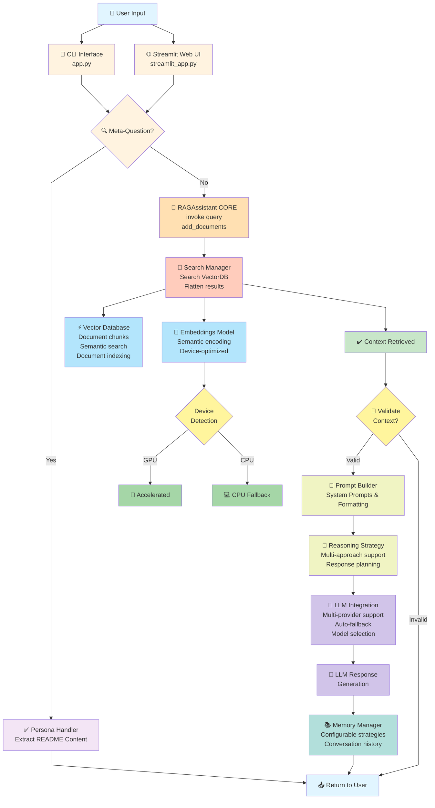
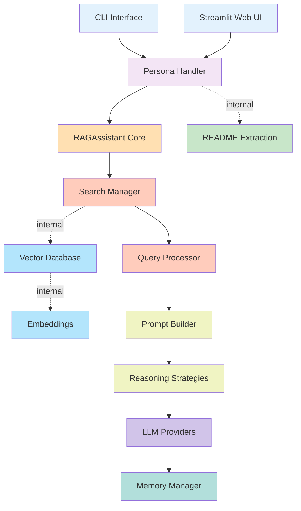
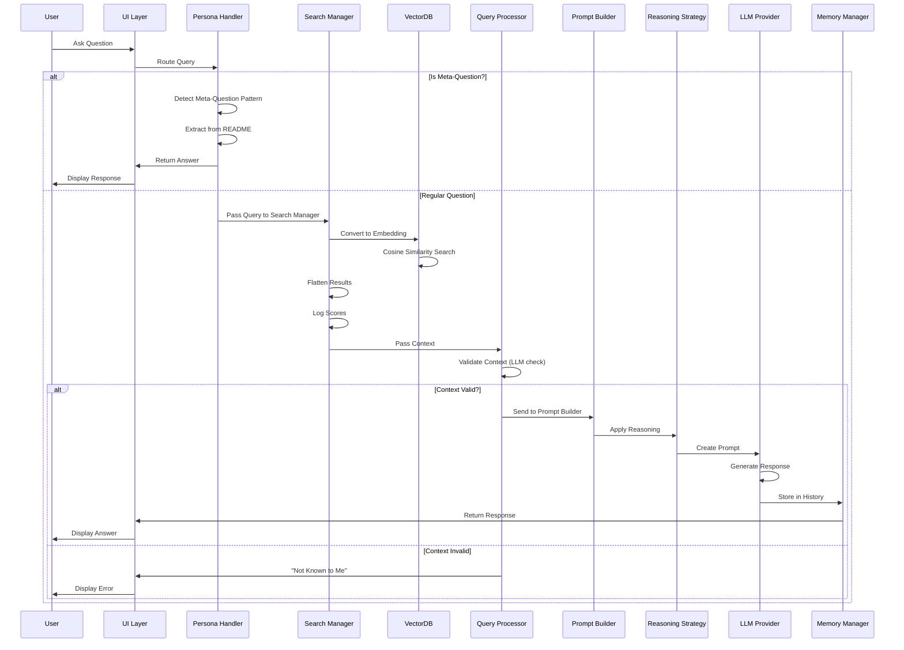
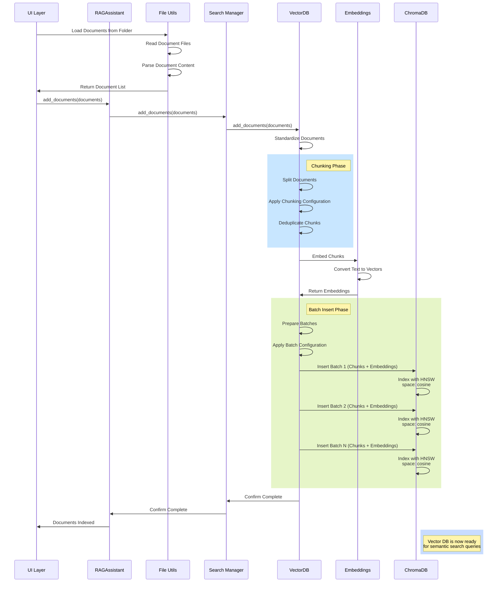
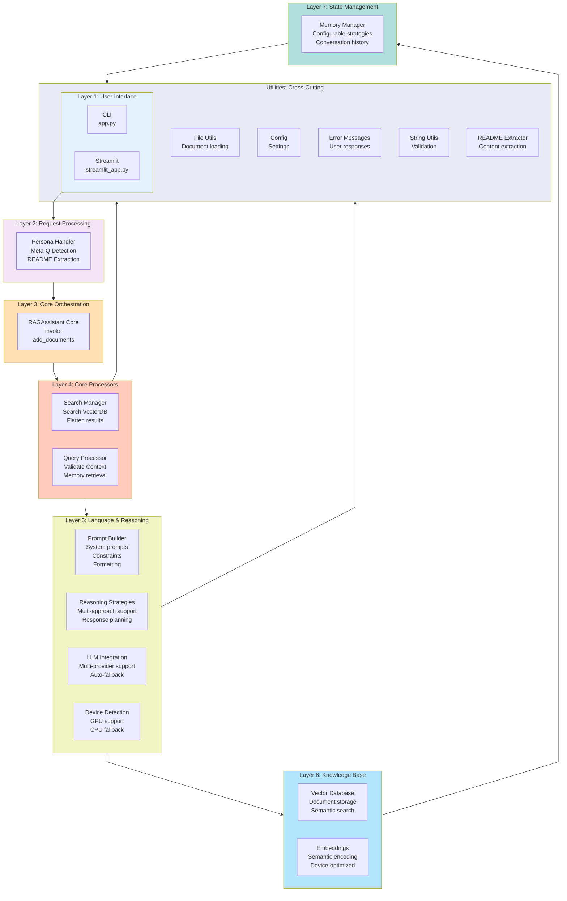
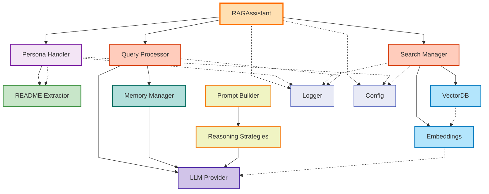

# RAG-Based AI Assistant - Architecture Diagram (Mermaid)

## System Architecture Flowchart

## Component Interaction Diagram

## Query Execution FlowAdd

## Document Ingestion Flow

## Layer Architecture Diagram

## Component Dependencies Diagram

## Query Processing Flow

```mermaid
%%{init: {'flowchart': {'curve': 'linear'}}}%%
flowchart LR
    START["Start: User Query"] --> META{Meta-Question?}
    
    META -->|Yes| DETECT["Detect Pattern"]
    DETECT --> EXTRACT["Extract from README"]
    EXTRACT --> RETURN1["Return Content"]
    RETURN1 --> END["Return to User"]
    
    META -->|No| SEARCH["Search Manager<br/>Retrieve Documents"]
    SEARCH --> EMBED["Convert to Embedding"]
    EMBED --> VDB["Search VectorDB"]
    VDB --> FLATTEN["Flatten Results"]
    FLATTEN --> VALIDATE["Query Processor<br/>Validate Context"]
    
    VALIDATE -->|Valid| REASON["Reasoning Strategy<br/>Select Approach"]
    VALIDATE -->|Invalid| NOTKNOWN["Return:<br/>Not Known to Me"]
    
    REASON --> PROMPT["Prompt Builder<br/>Create Prompts"]
    PROMPT --> LLM["LLM Provider<br/>Generate Response"]
    LLM --> MEMORY["Memory Manager<br/>Store in History"]
    MEMORY --> RETURN2["Return Response"]
    RETURN2 --> END
    
    NOTKNOWN --> END
    
    style START fill:#e3f2fd
    style META fill:#fff3e0
    style DETECT fill:#f3e5f5
    style EXTRACT fill:#c8e6c9
    style RETURN1 fill:#c8e6c9
    style SEARCH fill:#ffccbc
    style EMBED fill:#b3e5fc
    style VDB fill:#b3e5fc
    style FLATTEN fill:#ffccbc
    style VALIDATE fill:#ffccbc
    style REASON fill:#f0f4c3
    style PROMPT fill:#f0f4c3
    style LLM fill:#d1c4e9
    style MEMORY fill:#b2dfdb
    style RETURN2 fill:#c8e6c9
    style NOTKNOWN fill:#ffcdd2
    style END fill:#e3f2fd
```

---

## Legend

| Symbol | Meaning                  |
|--------|--------------------------|
| 👤     | User                     |
| 🎯     | Interface/Entry Point    |
| 🌐     | Web Interface            |
| 🔍     | Detection/Analysis       |
| 🧠     | Core Logic               |
| 🔎     | Search Operations        |
| 📝     | Processing               |
| 🛡️    | Safety/Validation        |
| ⚡      | Database                 |
| 🧮     | ML Models                |
| 🚀     | Performance Optimization |
| 🍎     | Platform Specific        |
| 💻     | Fallback                 |
| ✔️     | Validation Success       |
| 🤖     | AI/LLM                   |
| 🔗     | Integration              |
| 💬     | Output                   |
| 📚     | Storage                  |
| 📤     | Return to User           |
