# RAG-Based AI Assistant - Architecture Diagram (Mermaid)

## Query Handling Flowchart

```mermaid
%%{init: {'flowchart': {'curve': 'linear'}}}%%
graph TD
    A["👤 User Input"] --> B["🎯 CLI Interface"]
    A --> C["🌐 Streamlit Web UI"]

    B --> D["🧠 RAGAssistant Core<br/>Receives Query"]
    C --> D

    D --> E["✅ Persona Handler<br/>Meta-Question/<br/>Sensitive Check"]

    E -->|Sensitive| S["🚫 Sensitive Query<br/>Refuse Request"]
    S --> Z["📤 Return to User"]
    E -->|Readme Extract| F2["📖 README Extractor<br/>Project Info"]
    F2 --> F3["Extract Content"]
    F3 --> Z

    E -->|Regular Query| G["🔎 Search Manager<br/>Prepare Query"]

    G --> H["⚡ Vector Database<br/>Semantic Search"]

    H --> I["✔️ Query Processor<br/>Validate Context/Answer Quality"]

    I -->|Invalid| J["❌ Quality Below Threshold<br/>Answer Not Known to Me"]
    J --> Z

    I -->|Valid| QA["🔄 Query Augmentation<br/>Add Context if Follow-up"]

    QA --> L["🎯 Reasoning Strategy<br/>Apply Reasoning"]

    L --> K["🤖 Prompt Builder<br/>Construct Prompt"]

    K --> N["💬 LLM Response<br/>Generate Answer"]

    N --> O["📚 Memory Manager<br/>Store Conversation"]
    N --> Z["📤 Return to User"]

    O -.->|Retrieves for<br/>Follow-up Questions| I

    style A fill:#e1f5ff
    style B fill:#fff3e0
    style C fill:#fff3e0
    style D fill:#ffe0b2
    style E fill:#f3e5f5
    style S fill:#ffcdd2
    style F2 fill:#f3e5f5
    style F3 fill:#c8e6c9
    style G fill:#ffccbc
    style H fill:#b3e5fc
    style I fill:#ffccbc
    style J fill:#ffcdd2
    style QA fill:#b2dfdb
    style L fill:#f0f4c3
    style K fill:#f0f4c3
    style N fill:#d1c4e9
    style O fill:#b2dfdb
    style Z fill:#e1f5ff
```

## Document Ingestion Architecture Flowchart

```mermaid
%%{init: {'flowchart': {'curve': 'linear'}}}%%
graph TD
    A["📂 Document Store"] --> B["⚡ Document Standardization"]
    B --> C["✂️ Chunk Documents"]
    C --> D["🔄 Deduplicate Chunks"]
    D --> E["💾 Insert into Database"]

    style A fill:#e1f5ff
    style B fill:#b3e5fc
    style C fill:#fff59d
    style D fill:#f0f4c3
    style E fill:#d1c4e9
```

## Query Execution FlowAdd

## Document Ingestion Flow

## Layer Architecture Diagram

```mermaid
%%{init: {'flowchart': {'curve': 'linear'}}}%%
graph TD
    subgraph UIFACE["Layer 1: User Interface"]
        CLI["🎯 CLI"]
        WEB["🌐 Streamlit"]
    end

    subgraph RP["Layer 2: Request Processing"]
        PH["✅ Persona Handler"]
    end

    subgraph CO["Layer 3: Core Orchestration"]
        RAG["🧠 RAGAssistant Core"]
    end

    subgraph PROC["Layer 4: Core Processors"]
        SM["🔎 Search Manager"]
        QP["✔️ Query Processor"]
    end

    subgraph LR["Layer 5: Language & Reasoning"]
        PB["🤖 Prompt Builder"]
        RS["🎯 Reasoning Strategies"]
        LLM["🔗 LLM Integration"]
    end

    subgraph KB["Layer 6: Knowledge Base"]
        VDB["⚡ Vector Database"]
    end

    subgraph SM2["Layer 7: State Management"]
        MEM["📚 Memory Manager"]
    end

    subgraph UTIL["Utilities: Cross-Cutting Concerns"]
        FU["📂 File Utils"]
        CFG["⚙️ Config"]
        EM["⚠️ Error Messages"]
        UI_UTIL["🎨 UI Utils"]
        STR["📝 String Utils"]
        RE["📖 README Extractor"]
    end

    %% Main data flow
    UIFACE --> RP
    RP --> CO
    CO --> PROC
    CO --> KB
    PROC --> LR
    LR --> SM2
    SM2 --> PROC

    %% Response feedback
    CO -.->|Response| UIFACE

    %% Layer styles
    style UIFACE fill:#e3f2fd,stroke:#0277bd,stroke-width:2px
    style RP fill:#f3e5f5,stroke:#7b1fa2,stroke-width:2px
    style CO fill:#ffe0b2,stroke:#ff6f00,stroke-width:2px
    style PROC fill:#ffccbc,stroke:#d84315,stroke-width:2px
    style LR fill:#f0f4c3,stroke:#f57f17,stroke-width:2px
    style KB fill:#b3e5fc,stroke:#0277bd,stroke-width:2px
    style SM2 fill:#b2dfdb,stroke:#00695c,stroke-width:2px
    style UTIL fill:#e8eaf6,stroke:#3f51b5,stroke-width:2px
```

### Architecture Layers Overview

The system is organized into seven functional layers that progressively process queries from user input to response generation. **Layer 1 (User Interface)** accepts user queries through CLI or web interfaces and routes them to the **Layer 2 (Request Processing)** where the Persona Handler detects meta-questions, sensitive queries, and documentation requests. The **Layer 3 (Core Orchestration)** RAGAssistant Core orchestrates the entire pipeline and initializes Knowledge Base access. **Layer 4 (Core Processors)** performs semantic search and validates retrieved context quality. **Layer 5 (Language & Reasoning)** applies reasoning strategies, constructs optimized prompts, and invokes LLM providers to generate responses. **Layer 6 (Knowledge Base)** stores and retrieves document embeddings through ChromaDB's vector similarity search. **Layer 7 (State Management)** maintains conversation history using configurable memory strategies, enabling context-aware follow-up questions. Cross-cutting **Utilities** (File Utils, Config, Error Messages, UI Utils, String Utils, README Extractor) are available throughout all layers. The response flows back from the Core Orchestration layer to the User Interface, completing the query-response cycle while conversation memory feeds back to Core Processors for augmenting follow-up queries.

## Component Dependencies Diagram

## Query Processing Flow

---

## Legend

| Symbol | Meaning                  |
|--------|--------------------------|
| 👤     | User                     |
| 🎯     | Interface/Entry Point    |
| 🌐     | Web Interface            |
| 🔍     | Detection/Analysis       |
| 🧠     | Core Logic               |
| 🔎     | Search Operations        |
| 📝     | Processing               |
| 🛡️    | Safety/Validation        |
| ⚡      | Database                 |
| 🧮     | ML Models                |
| 🚀     | Performance Optimization |
| 🍎     | Platform Specific        |
| 💻     | Fallback                 |
| ✔️     | Validation Success       |
| 🤖     | AI/LLM                   |
| 🔗     | Integration              |
| 💬     | Output                   |
| 📚     | Storage                  |
| 📤     | Return to User           |
