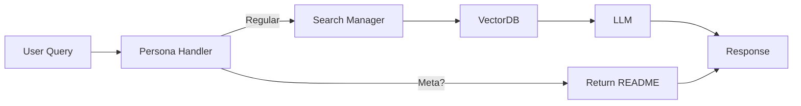

# Mermaid Diagrams - Quick Start Guide

## 📍 Location
File: `/ARCHITECTURE_DIAGRAM.md`

## 🎨 6 Diagrams Included

### 1. System Architecture Flowchart
**Purpose:** Complete end-to-end overview  
**Shows:** All layers, device detection, LLM selection, memory management  
**Best for:** Understanding complete system flow

### 2. Component Interaction Diagram
**Purpose:** Component relationships  
**Shows:** UI → Processing → Core → Reasoning → Output  
**Best for:** Architecture overview

### 3. Data Flow Diagram (Sequence)
**Purpose:** Step-by-step query processing  
**Shows:** Query path, meta-question branching, validation  
**Best for:** Detailed process understanding

### 4. Layer Architecture Diagram  
**Purpose:** System organization  
**Shows:** 7 layers with 20+ components  
**Best for:** Component placement

### 5. Component Dependencies
**Purpose:** Component coupling  
**Shows:** Direct and indirect dependencies  
**Best for:** Understanding relationships

### 6. Query Processing Flow
**Purpose:** Visual decision tree  
**Shows:** Process flow with branch points  
**Best for:** Walkthrough explanations

---

## 🚀 How to View

### Option 1: Mermaid Live Editor (Recommended)
1. Go to https://mermaid.live
2. Open `ARCHITECTURE_DIAGRAM.md`
3. Copy the diagram code (between \`\`\`mermaid and \`\`\`)
4. Paste into Mermaid Live Editor
5. View and interact

### Option 2: GitHub (If Committed)
1. Commit `ARCHITECTURE_DIAGRAM.md`
2. Push to GitHub
3. GitHub renders automatically

### Option 3: VS Code
1. Install "Markdown Preview Mermaid Support" extension
2. Open `ARCHITECTURE_DIAGRAM.md`
3. Preview shows rendered diagrams

### Option 4: Export as Image
```bash
# Using Mermaid CLI
npm install -g @mermaid-js/mermaid-cli
mmdc -i ARCHITECTURE_DIAGRAM.md -o diagrams/ -t dark
```

---

## 📋 Diagram Details

### System Architecture Flowchart
```
Nodes: User → UI → Persona Handler → [Meta-Q or Regular Q]
       Regular: Query Processor → Search Manager → VectorDB
                → Embeddings → Device Detection
                → Hallucination Prevention → Reasoning → LLM → Memory → User
Meta-Q: README Extraction → Return to User
Styling: Color-coded by layer/component type
```

### Component Interaction Diagram
```
Shows: 14 main components
Format: Left-to-right flow
Color: Component type based
Shows: Solid and dotted lines for dependency types
```

### Data Flow (Sequence Diagram)
```
Participants: User, UI, Persona Handler, Query Processor, Search Manager, VectorDB, etc.
Flow: Message passing between components
Shows: Alt paths (if-else logic)
Includes: Meta-question and regular question flows
```

### Layer Architecture Diagram
```
Layers: 7 vertical layers + utilities
Format: Nested boxes showing containment
Shows: Component responsibilities
Cross-layer: Utilities section
```

### Component Dependencies
```
Nodes: 18 components
Edges: Direct (solid) and indirect (dotted)
Shows: Primary and secondary dependencies
Styling: By component type
```

### Query Processing Flow
```
Start: User Query
Flow: Flowchart with decision points
Shows: Two main branches
End: Return to User or Error
Color: By processing stage
```

---

## 🎨 Color Legend

| Color | Meaning |
|-------|---------|
| Light Blue | User Interface, VectorDB |
| Light Purple | Meta-questions, LLM |
| Light Orange | Core Processing |
| Light Green | Success, Validation |
| Light Yellow | Reasoning, Strategies |
| Light Teal | State Management |
| Light Red | Errors |

---

## 📖 Use Cases

### For Documentation
```markdown
## Architecture

[Copy diagram here]

See [Mermaid Diagram](ARCHITECTURE_DIAGRAM.md#system-architecture-flowchart)
```

### For Presentations
1. Export to PNG: `mmdc -i ARCHITECTURE_DIAGRAM.md -o image.png -t dark`
2. Include in slides
3. Reference in speaker notes

### For Onboarding
1. Show each diagram in sequence
2. Explain layer by layer
3. Walk through query flow
4. Show component interactions

### For Publication
```markdown
# System Architecture

This project uses a 7-layer architecture...

[Embedded Mermaid diagrams showing complete system]

See architecture diagrams in ARCHITECTURE_DIAGRAM.md
```

---

## ✅ What's Shown

- ✅ All 7 architectural layers
- ✅ 20+ components with responsibilities
- ✅ Complete data flow (10 steps)
- ✅ Device detection (CUDA/MPS/CPU)
- ✅ LLM provider selection
- ✅ Hallucination prevention
- ✅ Meta-question handling
- ✅ Memory management
- ✅ Error paths
- ✅ Component dependencies

---

## 📝 Example Diagram Preview

### Simple Example - Query Processing


---

## 🔧 Technical Details

- **Format:** Markdown with Mermaid code blocks
- **Syntax:** Mermaid diagram syntax (GitHub-compatible)
- **Rendering:** Native in GitHub, Mermaid Live, VS Code
- **Export:** PNG, SVG, PDF via Mermaid CLI
- **Source:** Generated from README architecture (lines 250-420+)

---

## 🎯 Quick Navigation

To find specific diagram:
1. Open `ARCHITECTURE_DIAGRAM.md`
2. Look for `## [Diagram Name]`
3. Find corresponding `\`\`\`mermaid` block
4. Copy entire block
5. Paste into viewer

---

## 📞 Support

- **Mermaid Syntax Help:** https://mermaid.js.org
- **Mermaid Live:** https://mermaid.live
- **GitHub Mermaid:** https://docs.github.com/en/get-started/writing-on-github/working-with-advanced-formatting/creating-diagrams

---

**Created:** February 1, 2026  
**File:** ARCHITECTURE_DIAGRAM.md  
**Status:** ✅ Ready to use
